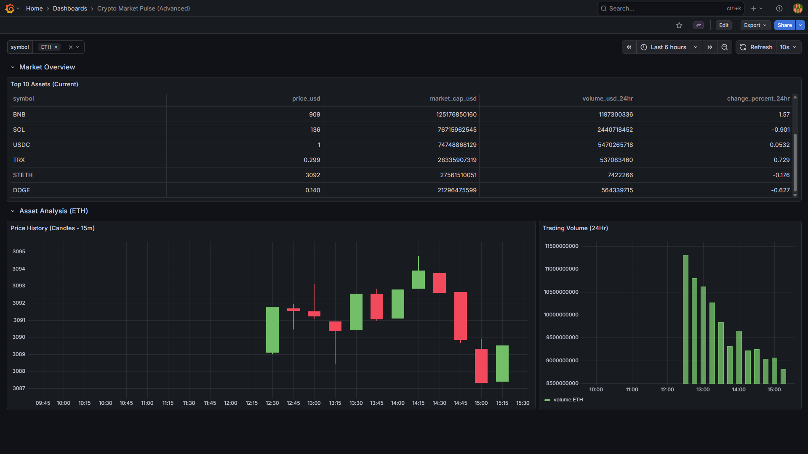

# CryptoMarketLakehouse

Pipeline de Engenharia de Dados end-to-end para análise de mercado de criptomoedas em tempo real, usando arquitetura Medallion com PySpark, Docker, PostgreSQL e Grafana.



---

## Stack

| Camada | Tecnologia |
|---|---|
| Ingestão | Python · Requests · CoinGecko API |
| Processamento | Apache Spark 3.5 (cluster standalone) |
| Armazenamento intermediário | Parquet (Medallion: Bronze / Silver / Gold) |
| Serving | PostgreSQL 15 via Spark JDBC |
| Visualização | Grafana 12 (23 painéis provisionados) |
| Orquestração | Python (Airflow-lite com retry + backoff) |
| Infraestrutura | Docker Compose (6 serviços) |

---

## Arquitetura

```
CoinGecko API
    │
    ▼
ingestion/extract_crypto.py   ← polling a cada 60s
    │
    ▼  JSON → data/landing/
    │
    ▼
job_bronze.py    ← ingestão incremental (dedup por source_file)
    │  Parquet → data/bronze/
    ▼
job_silver.py    ← watermark incremental, cast, dedup, filtro de qualidade
    │  Parquet → data/silver/
    ▼
job_gold.py      ← 9 outputs de KPI com Window Functions
    │  Parquet → data/gold/{top_assets, price_history, volatility,
    │             price_changes, moving_averages, market_dominance,
    │             liquidity, anomalies, history_stats}
    ▼
load_to_postgres.py  ← carrega 9 tabelas via JDBC
    │
    ▼
Grafana Dashboard    ← 23 painéis com variável $symbol interativa
```

---

## KPIs implementados na camada Gold

Todos calculados com PySpark Window Functions sobre a série temporal completa:

| Output | Técnica | Insight |
|---|---|---|
| `volatility` | `stddev()` + coeficiente de variação | Quais ativos têm maior risco relativo |
| `price_changes` | `lag()` over window | Variação % entre cada snapshot |
| `moving_averages` | `rowsBetween(-6,0)` e `(-13,0)` | MA7 e MA14 para cruzamento de tendência |
| `market_dominance` | participação relativa no market cap total | Dominância por ativo (estilo Bitcoin Dominance) |
| `liquidity` | `volume / market_cap` ratio | Liquidez relativa — facilidade de negociação |
| `anomalies` | Z-Score por símbolo | Detecção de spikes de preço ≥ 2σ |
| `top_assets` | snapshot do momento | Ranking atual por market cap |
| `price_history` | série temporal completa | Base para candlesticks e análise histórica |
| `history_stats` | `avg / max / min` por símbolo | Resumo estatístico histórico |

---

## Qualidade de Dados

- **Bronze incremental**: evita reprocessar arquivos já ingeridos comparando `source_file` URIs contra o Bronze existente
- **Silver com watermark**: processa apenas registros com `ingestion_time` mais recente que o máximo já no Silver — histórico nunca é sobrescrito
- **job_quality.py**: valida nulls, preços negativos e contagem de símbolos; falha com `exit(1)` para bloquear o pipeline
- **Silver deduplica** por `(id, ingestion_time)` para proteger contra reprocessamento

---

## Orquestrador com resiliência

```
Bronze ──► Silver ──► Gold ──► Serving
  ↑           ↑         ↑
retry 3x   retry 3x  retry 3x   (backoff: 10s → 20s → 40s)

Falha em Bronze → ABORT (Silver/Gold/Serving não rodam com dado sujo)
Falha em Serving → WARN (pipeline não é bloqueado por falha de carga)
```

Cada iteração registra: número do run, timestamp, duração, job que falhou e totais da sessão (runs / sucedidos / falhados).

---

## Dashboard Grafana

Variável `$symbol` (multi-select) conectada a **todos** os painéis analíticos:

- **Market Overview** — tabela de assets filtrada, total market cap, total volume 24h
- **Price + MA7/MA14** — série temporal com médias móveis sobrepostas
- **Volatility Ranking** — bar chart + tabela de desvio padrão por ativo
- **Market Dominance** — donut chart de participação no market cap total
- **Liquidity Analysis** — ranking de volume/market cap ratio
- **Anomaly Feed** — Z-Score calculado inline via SQL window function no PostgreSQL; linha de threshold em 2σ
- **Candlestick (15m)** — OHLC a partir de `crypto_price_history`
- **History Stats** — avg/max/min histórico por símbolo

---

## Como rodar

**Pré-requisito**: Docker Desktop

```bash
git clone <repo>
cd infra/docker
docker-compose up --build
```

| Serviço | URL | Credenciais |
|---|---|---|
| Grafana | http://localhost:3000 | admin / admin |
| Spark Master UI | http://localhost:8090 | — |

O pipeline inicia automaticamente. Em ~2 minutos os primeiros dados aparecem no Grafana.

---

## Estrutura do repositório

```
├── ingestion/          # Serviço de coleta (CoinGecko polling)
├── processing/         # Jobs PySpark: bronze, silver, gold, quality
├── serving/            # JDBC loader (9 tabelas) + export CSV
├── orchestration/      # Controlador com retry e abort logic
├── dashboards/         # JSON do dashboard + provisioning Grafana
├── infra/docker/       # docker-compose.yml
└── data/               # Volume local (ignorado no git)
    ├── landing/        # JSONs brutos
    ├── bronze/         # Parquet raw
    ├── silver/         # Parquet limpo
    └── gold/           # Parquet com KPIs
```

---

## Tecnologias e conceitos demonstrados

`PySpark` · `Window Functions` · `Medallion Architecture` · `Data Lakehouse` · `Incremental Processing` · `Data Quality` · `JDBC` · `Docker Compose` · `Grafana Provisioning` · `Time Series Analysis` · `Financial KPIs` · `Anomaly Detection` · `Moving Averages` · `Z-Score` · `ETL/ELT`
